# Kavach · कवच

**Know what's void before you sign.**

Clause-level analysis of Indian legal documents, and plain-English explanations of Indian court
judgments — where every claim cites the statute or the paragraph it came from, and claims that
can't be cited are deleted before you see them.

🔗 **Live:** https://kavach-823065407403.asia-south1.run.app
📍 Runs entirely in `asia-south1` (Mumbai)

> Legal **information**, not legal advice. Built for PromptWar Virtual Edition.

---

## The problem

A large share of clauses in everyday Indian contracts are already unenforceable — and people comply
with them anyway, because nobody ever told them.

| What the contract says | What Indian law says |
|---|---|
| "2-year non-compete after leaving" | **Void.** S.27, Indian Contract Act 1872 |
| "Arbitrator appointed by the Company" | **Invalid.** *Perkins Eastman v. HSCC* (SC, 2019) |
| "Pay ₹3,00,000 if you leave before 2 years" | Enforceable **only up to actual training cost.** S.74 ICA |
| "10 months security deposit" | Model Tenancy Act 2021 caps residential at **2 months** (adopting states) |
| "Tenant shall not approach any court" | **Void.** S.28 ICA |
| Agreement under-stamped | **Inadmissible in evidence.** S.35, Indian Stamp Act 1899 |

Most legal-AI tools answer "what does this document say?" Kavach answers two harder questions:
**which clauses cannot legally be used against you**, and **what protection is missing** — an
absence being structurally invisible to anything that only reads what's there.

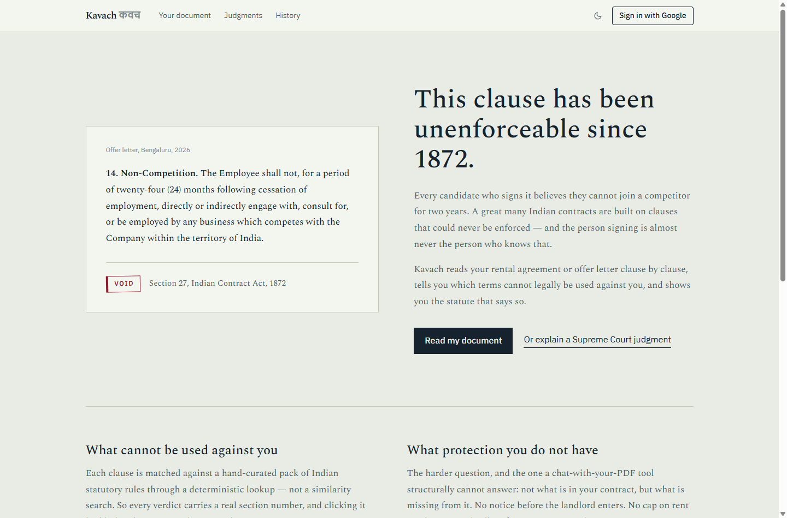

> **Build status.** All seven pipeline stages are built and running: ingest, segmentation,
> document-type detection, clause typing, the deterministic rule join, per-clause adjudication with
> citation validation, the absence diff, and synthesis. Plus document comparison, the judgment
> explainer with span-validated citations and translation into twelve languages, Google sign-in,
> and history. Still unbuilt: OCR for scanned PDFs, and an obligations timeline. The stage table
> below is authoritative.

---

## What it does

### 1 · Read any legal document

Upload a PDF or DOCX. Kavach works out what the document is, splits it into clauses with exact
character offsets, and lets you click any clause to highlight it in the source.

There is no "pick your document type" step — the type is detected. But the curated rule pack covers
**residential rental agreements and employment offer letters only**, and when a document falls
outside that, the app says so rather than bluffing.

Each clause is then typed, joined to its statutory rules, and judged. The document itself is tinted
by verdict, so the damage is visible in the text rather than in a separate report.

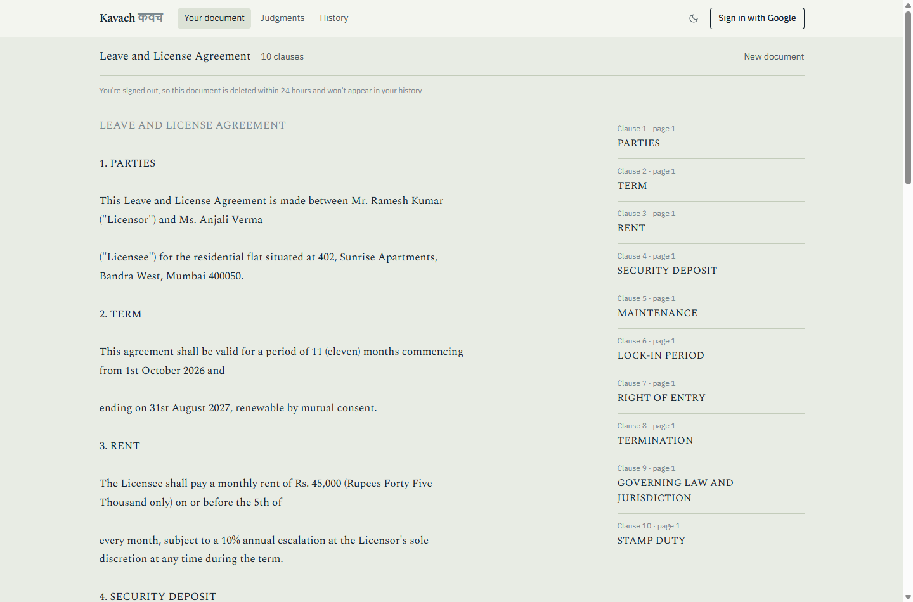

Click a clause for the finding: what it does to you in plain English, the section it falls foul of,
and the exact counter-language to ask for.

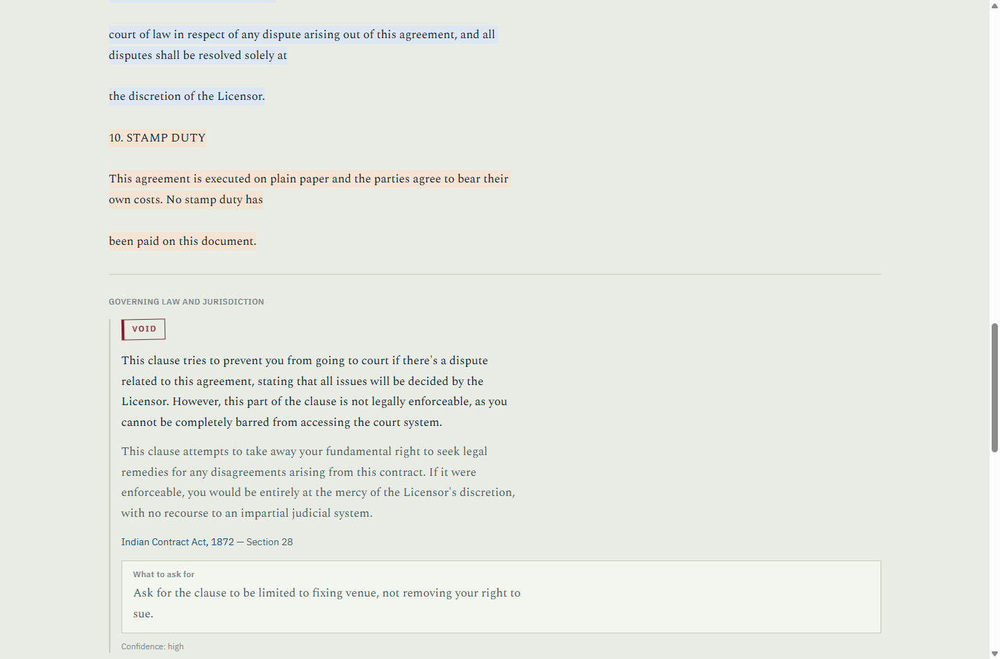

### 2 · See what *isn't* there

The output nobody else ships. Not what your contract says — what it doesn't.

This is a set operation, not a generation: a curated list of protections that actually matter,
minus every topic the document covers. It cannot invent a missing protection, and it cannot fail to
notice one. (The expected list is curated precisely because a naive diff over the rule pack would
announce that your contract is "missing a non-compete clause".)

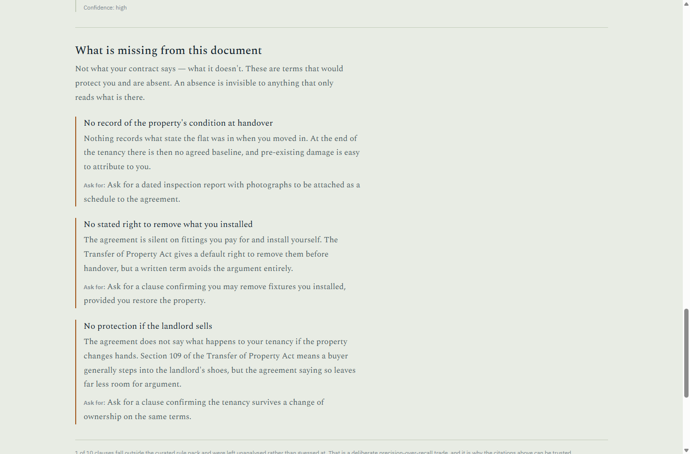

### 3 · Get something you can act on

A summary, a prioritised checklist, and a draft email to the other party.

The checklist is **not generated** — it is assembled from the `negotiationAsk`
already carried by each validated finding and each curated protection, so every
action traces back to a checked citation. Only the prose goes through a model,
and it is handed the asks rather than the document.

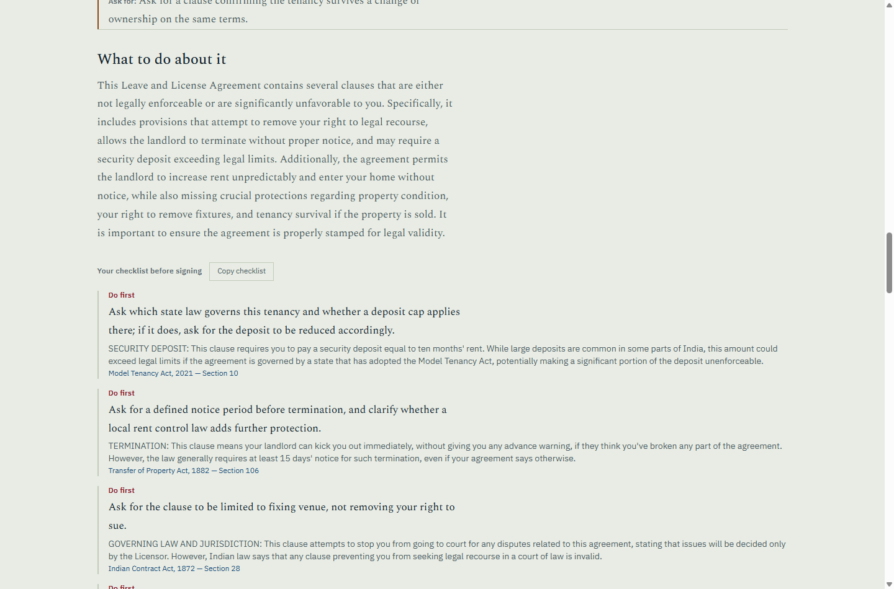

### 4 · Compare two documents

Two offers, two tenancy agreements, or the same contract before and after their
edits. Compared topic by topic, and against the protections a document of this
kind should contain.

Deterministic — it uses the clause types and verdicts the analyses already
produced, so it cannot claim a difference the underlying documents don't have.

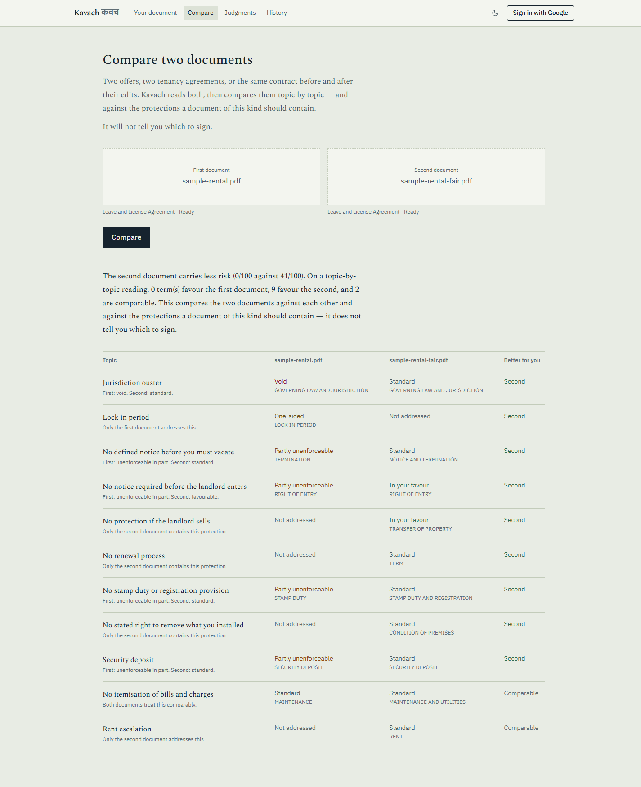

### 5 · Ask, with the sources shown

Questions are answered beside the document itself. Every answer lists which tools produced it —
read the document, looked up the statute, read the judgment — so the grounding claim can be
*checked* rather than trusted.

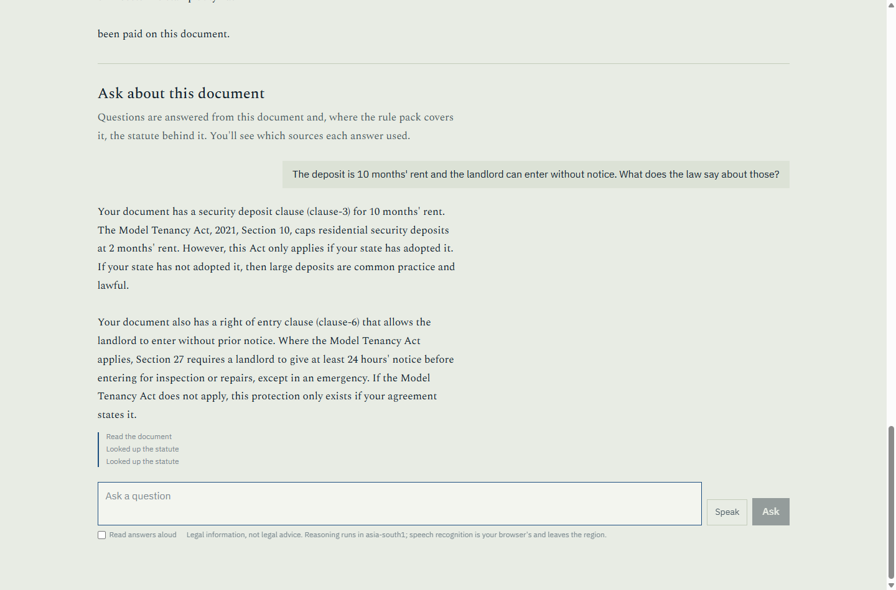

### 6 · Understand a judgment

A judgment runs to a hundred pages before it says who won. Kavach sets out what the court was
asked, what it decided, why, and what it expressly **does not** decide — with every line traceable
to the paragraph of the original beside it.

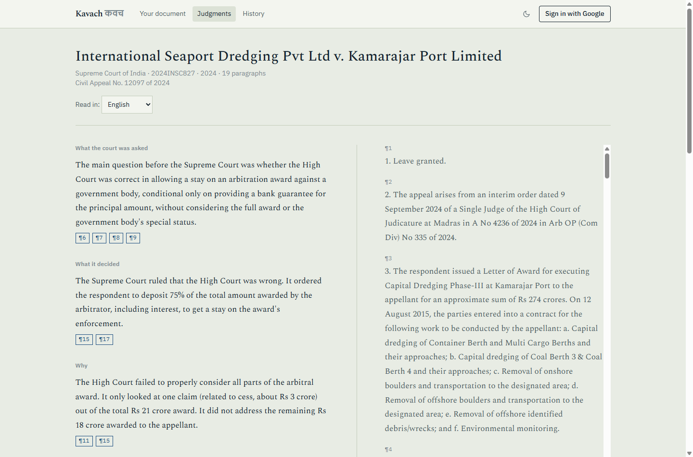

Search by subject or party, and filter by court, year, or case number.

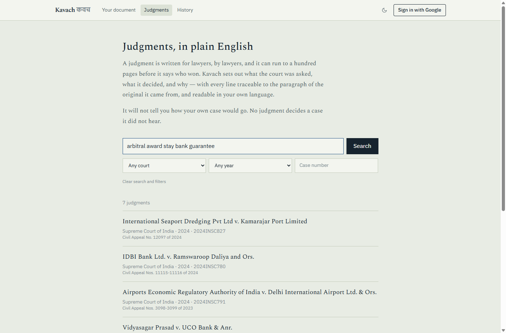

### 7 · Read it in your own language

Explanations translate into twelve Indian languages. Terms of art keep the English in brackets, and
**paragraph citations are reattached from the validated English original** — so a translation error
can never move a citation.

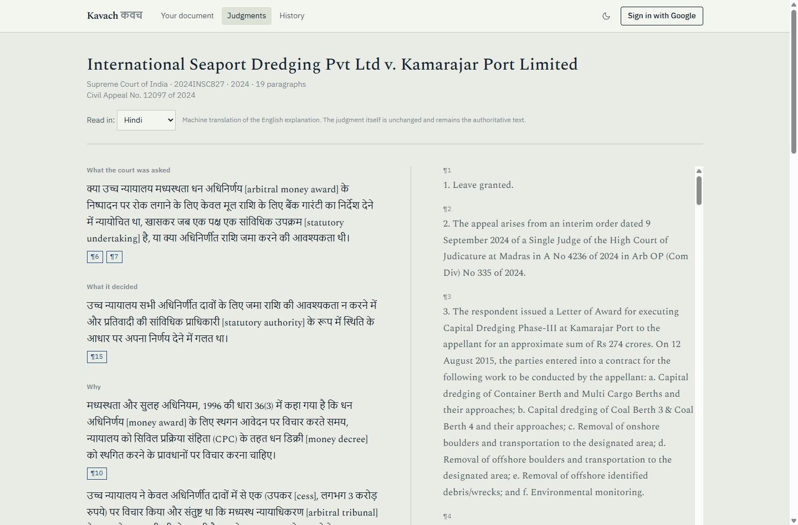

---

## How the grounding actually works

This is the part that matters. Three mechanisms, and only one of them is a prompt.

**1 · Rule retrieval is a deterministic join, not a vector search.**
`(docType, clauseType) → RuleCard[]`. Embedding search over statute text is the main source of
fabricated section numbers, and a wrong citation in a legal demo is fatal. Coverage is limited to
what's curated — a deliberate precision-over-recall trade.

**2 · Fabricated citations are structurally unrenderable.**
On both sides, and after generation rather than by asking nicely:

- **Contracts** — every `ruleId` a verdict cites must exist in the loaded pack. Ones that don't are
  deleted, and a finding that loses *all* its citations is forced to `confidence: LOW` and flagged
  as needing a lawyer. Statute and section are then **re-derived from the pack rather than trusted
  from the model's output**, so a citation cannot even be subtly misquoted.
- **Judgments** — every paragraph citation is checked against the real paragraph set. Claims whose
  citations don't resolve are deleted, and the count is shown to the reader ("No statements failed
  that check").

We don't ask the model to be honest; we make dishonesty impossible to display.

**3 · The agent has no free-form legal answer path.**
It holds five tools — `lookup_rule`, `analyse_clause`, `search_judgments`, `explain_judgment`,
`ask_a_lawyer` — and may only say what they returned. `ask_a_lawyer` is the refusal path promoted to
a first-class tool, so "I can't answer that, here's what to ask a lawyer" is an intended outcome
rather than a failure.

```
"Which clauses are one-sided against me?"   → information. Answered, with the section.
"Should I sign this? Will I win?"           → advice. Refused, with the question to ask a lawyer.
```

Document text is always wrapped as untrusted data and never treated as instruction.

---

## Architecture

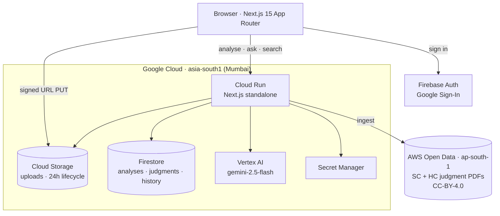

One Cloud Run service. The pipeline is in-process; parallelism comes from `Promise.all` over Vertex
AI calls, not from more services.

### The clause pipeline

| Stage | What it does | Model | Status |
|---|---|---|---|
| **0 · Ingest & segment** | GCS → text with character offsets → `Clause[]`. Numbering heuristics, then one LLM repair pass that may only *merge adjacent* clauses — never invent offsets | none / Flash | ✅ built |
| **1 · Document frame** | Detect document type, governing state, which side the user is on | Flash | ✅ built |
| **2 · Clause typing** | Each clause → one label from the taxonomy, plus any secondary topics it also covers | Flash | ✅ built |
| **3 · Rule retrieval** | `(docType, clauseType)` → `RuleCard[]` | **deterministic** | ✅ built |
| **4 · Adjudication** | Per clause: verdict, severity, plain English, statutory basis, negotiation ask | Flash | ✅ built |
| **5 · Absence diff** | Curated expected protections − topics the document covers | **deterministic** | ✅ built |
| **6 · Synthesis** | Summary, prioritised checklist, negotiation email, lawyer questions | Flash + **deterministic** | ✅ built — the checklist and lawyer questions need no model at all |
| **7 · Grounded Q&A** | The agent's tool loop | Flash | ✅ built |

The clause — not the document — is the unit of context. Nothing ever sees 40 pages and is asked to
"find problems."

### The judgment pipeline (built)

Ingest from the AWS mirror → strip law-report editorial matter → split on the judgment's **own**
paragraph numbering → explain with per-paragraph citations → validate every citation against the
real paragraph set → optionally translate, reattaching citations from the validated original.

### Verdicts

`VOID` · `UNENFORCEABLE_IN_PART` · `ONEROUS_BUT_VALID` · `STANDARD` · `FAVOURABLE`

A clause with no curated rule to judge it against is **not** adjudicated — it's reported as
unanalysed, with the count shown. There would be nothing to judge it against except the model's own
legal knowledge, which is exactly what this design forbids.

---

## Data sources and legal basis

**Statutory rules** — hand-curated pack of 41 rules across rental and employment clause types, each
carrying statute, section, `appliesWhen` / `doesNotApplyWhen`, plain English, and a negotiation ask.
Case law is cited only where the authority is well established; where it isn't, the rule cites the
statutory section alone. Never an invented case name.

**Judgments** — the [AWS Open Data mirror](https://registry.opendata.aws/) of eCourts judgments
(`indian-supreme-court-judgments`, `indian-high-court-judgments`, ap-south-1, CC-BY-4.0).

There is **no public government API for Indian judgment text**: eCourts' judgment search is
CAPTCHA-gated, NJDG publishes pendency statistics rather than judgments, and data.gov.in's judiciary
catalog contains no judgment text at all. The AWS mirror is the realistic source, and it happens to
sit in Mumbai too.

> **Copyright.** Reproducing the text of a court judgment is not an infringement under
> **s.52(1)(q), Copyright Act 1957**. That covers the judgment — *not* the law report's editorial
> apparatus. Kavach strips headnotes, "Case Law Cited", "List of Keywords", counsel appearances and
> the headnote author's credit before storing anything, and **fails closed**: if editorial matter is
> present but the judgment body can't be located confidently, the judgment is refused rather than
> ingested.

---

## Engineering

### Testing

```bash
npm test          # 76 unit tests
npm run test:e2e  # 14 browser tests, incl. axe on every page in both themes
npm run lint      # eslint + jsx-a11y + react-hooks
npx tsc --noEmit  # type check
```

The suite covers the logic the product's claims rest on, and most of it exists
because a specific bug got through first:

| Area | What it pins down |
|---|---|
| `adjudicate.test.ts` | A fabricated `ruleId` is deleted; statute and section are re-derived from the pack; a finding that loses every citation is downgraded to LOW and flagged for a lawyer |
| `explain-judgment.test.ts` | Unresolvable paragraph citations are stripped, uncited claims deleted, drops counted per section |
| `judgments.test.ts` | Editorial matter is stripped and ingest **fails closed**; paragraph indices match the judgment's own numbering; offsets slice back exactly; an SC judgment is never misfiled as a High Court one |
| `absence.test.ts` | Secondary clause topics count as covered; no clause type the reader wouldn't want is ever reported "missing" |
| `rules.test.ts` | Rule-pack integrity: unique ids, no cross-document leakage, every expected-protection keyed to a real taxonomy entry |
| `rate-limit.test.ts` | Per-caller and per-bucket isolation, window expiry, unidentified callers still limited |
| `compare.test.ts` | Severity ranking is from the reader's side; a missing protection counts against the document lacking it; secondary topics count as present; no difference is reported that neither document contains |
| `synthesize.test.ts` | The checklist is a projection of validated findings and carries their citations; unenforceable terms outrank one-sided ones; nothing is invented when there is nothing to ask for |

Two of these were written from real regressions: paragraph indices were once
off by one (so a citation to ¶14 resolved to ¶15), and 7 of 11 Supreme Court
judgments were misfiled as High Court ones because the text heuristic matched
the High Court order under appeal. Both now fail loudly if reintroduced.

**Accessibility is tested, not asserted.** `e2e/accessibility.spec.ts` runs
axe against every page in both light and dark themes at WCAG 2.1 AA, plus
behavioural checks: the skip link works, the upload control is focusable, focus
is visibly indicated, and the theme toggle exposes its state. That suite caught
a contrast failure I had already "fixed" once — my hand calculation said 4.54:1,
the browser measured 4.46:1 against a 4.5 requirement. The token is now chosen
from measured ratios with headroom on every surface it is painted on.

CI runs lint, types, unit tests, build, the browser suite, and a production
dependency audit on every push.

### Security

| Control | Where |
|---|---|
| Firestore closed to all direct client access | [`firestore.rules`](firestore.rules) — verified live: anonymous read/write both 403 |
| Least-privilege runtime identity | Dedicated `kavach-run` SA; replaced the default compute SA, which held project-wide `roles/editor` |
| Secrets never in the image or repo | Secret Manager, mounted at deploy; full-history scan is clean |
| Ingest endpoint fails closed | Returns 404 unless `INGEST_TOKEN` is configured, so a deploy can't expose an unauthenticated write path |
| Rate limiting on every paid endpoint | `src/lib/rate-limit.ts` — the realistic attack here is cost, not data theft |
| Upload size cap + bucket pinning | 15 MB; reads are refused from any bucket but our own |
| Ownership checks | A saved analysis 404s for anyone but its owner — obscurity alone stops being enough once it no longer expires |
| Prompt injection | Document and judgment text is wrapped as untrusted data and declared non-instruction in the system layer |
| Security headers | CSP, `X-Frame-Options`, `X-Content-Type-Options`, `Referrer-Policy`, `Permissions-Policy`, HSTS |
| Request size limits | 15 MB upload, 4,000-character questions, 20-turn conversations — an unbounded prompt is both a cost problem and a way to bury instructions far from the system layer |
| Dependency posture | `npm audit` is clean of **critical** findings. The 10 remaining are transitive inside Google's own Cloud SDKs (`uuid@9`, `teeny-request`) with no upstream fix available; none are reachable from user input |

The Firebase web API key in `firebase-client.ts` is public by design — it ships
in the client bundle regardless, and access is controlled by the rules above.

### Accessibility

Audited and fixed, not assumed:

- Every interactive element is keyboard operable. Clause spans in the document
  pane were `<span onClick>` — they are now real buttons with `aria-pressed`
  and a verdict announced in their accessible name.
- The upload input was `display:none`, which removed the app's primary action
  from the accessibility tree entirely. It is `sr-only` now: hidden, still
  focusable, still announced.
- `focus:outline-none` was out-specifying the global focus ring and leaving
  keyboard users with no visible focus. Removed; the ring always wins.
- Async state is announced — `role="status"` on progress, `role="alert"` on
  errors, `aria-live` on answers and results.
- `--color-ink-faint` measured **2.98:1** on paper and is used for most
  secondary text. Darkened to clear AA, along with the caution and brass
  verdict colours.
- Skip link, `<main>` landmarks, one `<h1>` per view, `lang` on translated
  content and on कवच so a screen reader doesn't read Devanagari in an English
  voice, focusable scroll regions, `aria-pressed` on the theme toggle.

`jsx-a11y` now runs in CI — it had never run before, which is precisely why
these survived to production.

### Efficiency

- **Judgment explanations and translations are cached** in Firestore. A
  judgment's text never changes, so its explanation is a pure function of it;
  regenerating per page view cost ~25s and real money for identical output.
  Measured on the live service: **25.35s → 0.23s.**
- **Search pushes filters into Firestore** as indexed equality queries instead
  of reading the collection and discarding most of it in memory, and the
  per-judgment search haystack is capped at 1.5 KB — it was 8 KB, which turned
  every query into megabytes of reads.
- **Facets are precomputed** at ingest into one document, rather than scanned
  out of the whole collection on every visit to the search page, and carry a
  cache header — they change only when the corpus is ingested.
- Judgment search runs its Firestore query and its bearer-token verification
  concurrently; neither needs the other, and in series every search waited on
  a token check to produce results that did not depend on it.
- Corpus ingest processes four PDFs at a time. Serial left the container idle
  through the network waits; unbounded would have made peak memory scale with
  batch size, and `extractPdfText` holds a parsed document against 1 GiB.
- **The Firebase SDK is not in the first load of any page.** It is ~130 kB,
  nothing can be painted with it, and `AuthProvider` sits in the root layout —
  so every page paid for it up front. Dynamically imported from the mount
  effect instead: first-load JS fell ~35 kB on every route (`/compare`
  152 → 117 kB, `/judgments/[id]` 154 → 118 kB).
- Judgment reads carry `Cache-Control` — the text is immutable once ingested.
- Paragraph writes go in a single batch rather than a round trip per chunk.
- `min-instances=1` on Cloud Run, so an evaluator never meets a cold start.
- **Every deterministic model call is cached** by its whole request — system
  instruction, prompt, response schema and model id hashed together. Framing,
  clause typing, adjudication and synthesis are pure functions of their prompt,
  so re-analysing a document is a Firestore read rather than a fan-out of model
  calls. Deliberately *not* keyed on clause text alone: boilerplate shared
  between two contracts would hit the cache, but the prompt also carries the
  governing state, which side the reader is on and the joined rule cards, and
  each of those can change the verdict. The agent is excluded — repeating
  yourself is the point of a conversation.
- Adjudication runs one call per clause scoped to ~2k tokens each, rather than
  one 40-page prompt, **six in flight at a time**. It was an unbounded
  `Promise.all`, which on a forty-clause contract opened forty simultaneous
  Vertex AI requests against a project-wide quota shared with every other
  surface — so the burst either queued anyway or came back 429, and a
  rate-limit error is indistinguishable downstream from a clause the model
  could not judge. Both land in `unanalysed`, which reads to the user exactly
  like a clause with nothing wrong in it.
- Stage 3 and Stage 5 are deterministic — no model call at all.
- Clause typing is batched 10 per request.
- `AuthProvider` context is memoised; without it the judgment explanation
  request fired twice per page load. It also exposes a single `authedFetch`,
  replacing six hand-rolled copies of the token-attaching pattern — each of
  which was a chance to forget it and silently lose an ownership check.

## Stack

| | |
|---|---|
| **Framework** | Next.js 15 (App Router), React 19, TypeScript, Tailwind v4 |
| **Model** | `gemini-2.5-flash` on Vertex AI, `asia-south1` |
| **Data** | Firestore (Native), Cloud Storage, Secret Manager |
| **Auth** | Firebase Auth — Google Sign-In |
| **Hosting** | Cloud Run, container built from `Dockerfile` |
| **Extraction** | `pdfjs-dist` (PDF, with offsets + page mapping), `mammoth` (DOCX) |
| **Validation** | Zod on every structured stage |

**Why Flash everywhere, not Flash + Pro?** `gemini-2.5-pro` isn't served in `asia-south1` — verified
live, it 404s regionally and only answers from the `global` endpoint. Routing adjudication through
`global` would break the "everything stays in Mumbai" data-residency claim, so the pipeline uses
Flash in-region instead. Per-clause context is narrow by design (one clause plus its already-correct
rule cards), which is well within Flash's range.

---

## Running it

```bash
npm install
npm run dev
```

Needs Application Default Credentials with access to the GCP project:

```bash
gcloud auth application-default login
```

Signed upload URLs are produced via IAM `signBlob`, which needs a service-account identity — so the
upload path works on Cloud Run out of the box, but locally requires impersonation:

```bash
gcloud auth application-default login --impersonate-service-account=kavach-run@promptwar-501405.iam.gserviceaccount.com
```

Deploy:

```bash
npm run deploy
```

Two steps, not one, and the reason is worth knowing before someone "simplifies" it back.
Next inlines `NEXT_PUBLIC_*` at build time, so the Firebase web config has to reach
`docker build` as build args. `gcloud run deploy --source . --set-build-env-vars` does not do
that for a Dockerfile build — gcloud accepts the flag, silently drops it, and the resulting
`docker build` step carries no `--build-arg` at all (confirmed by reading the build back with
`gcloud builds describe`). Nothing errors; the app serves every page and only the sign-in
button is dead. So the build goes through `cloudbuild.yaml`, which passes the args explicitly,
and `npm run deploy` refuses to start if any of the six values is missing rather than shipping
that failure quietly.

Populate the judgment corpus (requires `INGEST_TOKEN`, mounted from Secret Manager; the route
returns 404 when it isn't set, so a deployment can't expose an unauthenticated write path):

```bash
curl -X POST "$URL/api/judgments/ingest" -H "x-ingest-token: $TOKEN" -H "Content-Type: application/json" -d '{"source":"sc","paths":["2024_10_1503_1512"]}'
```

---

## Privacy

- Every service in `asia-south1`. Documents are processed and stored in India.
- **Anonymous analyses are deleted after 24 hours** — a GCS lifecycle rule on the bucket and a
  Firestore TTL policy on `expiresAt`, both actually enforced, not just promised.
- Signed-in users keep their documents until they delete them.
- **History is recorded for signed-in users only.** Keeping an activity trail for someone who never
  identified themselves would collect more than this product needs.
- Delete-all-history is a real button that really deletes.
- Cloud Run runs as a dedicated least-privilege service account, not the default compute identity.

One honest caveat: browser speech recognition (the "Speak" button) sends audio to the browser
vendor, which is outside the region. Only your spoken question goes that way — never document or
judgment text — and typing avoids it entirely. This is stated in the UI, not buried here.

---

## Known limits

Stated plainly, because a tool that hides its edges can't be trusted at its centre.

1. **The rule pack is finite and hand-curated.** Two document types. A clause outside the taxonomy
   is reported as unanalysed rather than guessed at. This is why the citations can be trusted.
2. **Rule citations need a final human pass.** They were drafted conservatively against
   well-established provisions, but "verified against the bare act by a human" is a distinct step and
   is not yet complete.
3. **State-level variation is partial.** The Model Tenancy Act 2021 has not been adopted uniformly;
   rules carry `appliesWhen` and the system says so when adoption is uncertain.
4. **The judgment corpus is a small curated subset**, not all of Indian case law. Absence from
   search means Kavach doesn't hold the case, not that no such case exists.
5. **Segmentation quality bounds everything.** A badly scanned document produces bad clauses.
   Scanned-PDF OCR is not yet wired up; text-layer PDFs only.
6. **Translations are machine-produced.** The English explanation, and the judgment itself, remain
   the authoritative texts.
7. **Not legal advice.** When a question turns on facts outside the document, Kavach refuses and
   hands you the question to put to a lawyer.

---

## Against the problem statement

> *"Build a GenAI-powered solution that makes legal information and basic legal
> assistance more accessible by helping users understand, compare, and navigate
> legal documents and information."*

| The brief asked for | Where it is |
|---|---|
| Simplifying complex legal documents | Clause segmentation + plain-English per-clause findings |
| Highlighting important clauses, obligations, risks | Verdicts tinting the document itself, ranked by severity, with a risk score |
| Answering questions based on provided legal documents | The Ask panel, answering only from tool output over *your* document |
| Helping users understand their options and next steps | `negotiationAsk` per clause, plus the ranked checklist of what to do before signing |
| Generating summaries, checklists, actionable outputs | Stage 6: a plain-English summary, a prioritised pre-signing checklist, and a draft negotiation email — all copyable |
| Helping users prepare questions for a legal professional | `ask_a_lawyer` as a first-class tool, and `lawyerQuestion` on any finding that turns on outside facts |
| Comparing contracts, agreements, policies | `/compare` — two documents diffed topic by topic, plus each against the statutory baseline and the protections it should contain |

> *"Solutions should provide information and assistance, rather than replace
> professional legal advice."*

This is the constraint the architecture is built around rather than a
disclaimer bolted on. The refusal path is a tool, not a failure mode; the line
between information and advice is drawn explicitly in the agent's contract with
worked examples on both sides; and a judgment explanation carries a section
stating what the judgment **does not** decide.

> *"Original ideas, experimentation, and out-of-the-box thinking are encouraged."*

The two things here that a chat-with-your-PDF build cannot do: **telling you
which clauses are unenforceable** (which needs a curated statutory baseline, not
retrieval over the document), and **telling you what is missing** (which is
structurally invisible to anything that only reads what is in the context
window).

## Documentation

- [`PLAN.md`](PLAN.md) — scope, the seven-day plan, risks, and a log of every scope reversal with
  the reasoning that produced it
- [`docs/ARCHITECTURE.md`](docs/ARCHITECTURE.md) — context pipeline, failure-mode mitigations,
  instruction hierarchy, token budget, data model
- [`docs/HACKATHON.md`](docs/HACKATHON.md) — problem statement and scope decision log

---

*Kavach is not a law firm and does not provide legal advice. It reports what a document says and
what a statute or judgment says. For advice on your own situation, consult a lawyer.*
