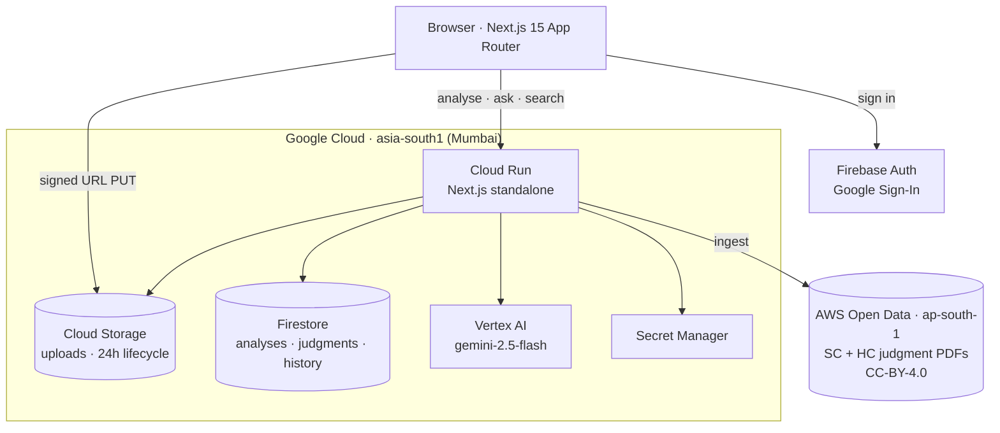

# Kavach · कवच

**Know what's void before you sign.**

Clause-level analysis of Indian legal documents, and plain-English explanations of Indian court
judgments — where every claim cites the statute or the paragraph it came from, and claims that
can't be cited are deleted before you see them.

🔗 **Live:** https://kavach-823065407403.asia-south1.run.app
📍 Runs entirely in `asia-south1` (Mumbai)

> Legal **information**, not legal advice. Built for PromptWar Virtual Edition.

---

## The problem

A large share of clauses in everyday Indian contracts are already unenforceable — and people comply
with them anyway, because nobody ever told them.

| What the contract says | What Indian law says |
|---|---|
| "2-year non-compete after leaving" | **Void.** S.27, Indian Contract Act 1872 |
| "Arbitrator appointed by the Company" | **Invalid.** *Perkins Eastman v. HSCC* (SC, 2019) |
| "Pay ₹3,00,000 if you leave before 2 years" | Enforceable **only up to actual training cost.** S.74 ICA |
| "10 months security deposit" | Model Tenancy Act 2021 caps residential at **2 months** (adopting states) |
| "Tenant shall not approach any court" | **Void.** S.28 ICA |
| Agreement under-stamped | **Inadmissible in evidence.** S.35, Indian Stamp Act 1899 |

Most legal-AI tools answer "what does this document say?" Kavach is built to answer two harder
questions: **which clauses cannot legally be used against you**, and **what protection is missing**
— an absence being structurally invisible to anything that only reads what's there.


> **Build status — read this before judging the claims above.**
> This is a hackathon project mid-build. What works today: document ingest and clause segmentation,
> document-type detection, the curated rule pack reachable through the agent, the full judgment
> explainer with span-validated citations and translation, Google sign-in, and history.
> **Not yet built: automatic per-clause verdicts (Stage 4) and the missing-protection diff (Stage 5).**
> The rule pack, schemas and validation they depend on are in place; the passes that drive them are
> not. The stage table below marks exactly what is and isn't wired up.
> The VOID stamp on the landing page above is an illustration of the target output, not live output.

---

## What it does

### 1 · Read any legal document

Upload a PDF or DOCX. Kavach works out what the document is, splits it into clauses with exact
character offsets, and lets you click any clause to highlight it in the source.

There is no "pick your document type" step — the type is detected. But the curated rule pack covers
**residential rental agreements and employment offer letters only**, and when a document falls
outside that, the app says so rather than bluffing.

Per-clause verdict badges are the next stage and aren't live yet — today the clause list is the
navigable structure, and legal analysis happens through the Ask panel below it.


### 2 · Ask, with the sources shown

Questions are answered beside the document itself. Every answer lists which tools produced it —
read the document, looked up the statute, read the judgment — so the grounding claim can be
*checked* rather than trusted.


### 3 · Understand a judgment

A judgment runs to a hundred pages before it says who won. Kavach sets out what the court was
asked, what it decided, why, and what it expressly **does not** decide — with every line traceable
to the paragraph of the original beside it.


Search by subject or party, and filter by court, year, or case number.


### 4 · Read it in your own language

Explanations translate into twelve Indian languages. Terms of art keep the English in brackets, and
**paragraph citations are reattached from the validated English original** — so a translation error
can never move a citation.


---

## How the grounding actually works

This is the part that matters. Three mechanisms, and only one of them is a prompt.

**1 · Rule retrieval is a deterministic join, not a vector search.**
`(docType, clauseType) → RuleCard[]`. Embedding search over statute text is the main source of
fabricated section numbers, and a wrong citation in a legal demo is fatal. Coverage is limited to
what's curated — a deliberate precision-over-recall trade.

**2 · Fabricated citations are structurally unrenderable.**
For judgments this is **live today**: every paragraph citation is checked against the real paragraph
set after generation, and claims whose citations don't resolve are **deleted before render, with the
count shown to the user** ("No statements failed that check"). We don't ask the model to be honest;
we make dishonesty impossible to display.

The same mechanism is written for the contract side — `isValidRuleId` validates a `ruleId` against
the loaded pack — but it isn't exercised yet, because Stage 4 doesn't produce rule IDs yet.

**3 · The agent has no free-form legal answer path.**
It holds five tools — `lookup_rule`, `analyse_clause`, `search_judgments`, `explain_judgment`,
`ask_a_lawyer` — and may only say what they returned. `ask_a_lawyer` is the refusal path promoted to
a first-class tool, so "I can't answer that, here's what to ask a lawyer" is an intended outcome
rather than a failure.

```
"Which clauses are one-sided against me?"   → information. Answered, with the section.
"Should I sign this? Will I win?"           → advice. Refused, with the question to ask a lawyer.
```

Document text is always wrapped as untrusted data and never treated as instruction.

---

## Architecture



One Cloud Run service. The pipeline is in-process; parallelism comes from `Promise.all` over Vertex
AI calls, not from more services.

### The clause pipeline

| Stage | What it does | Model | Status |
|---|---|---|---|
| **0 · Ingest & segment** | GCS → text with character offsets → `Clause[]`. Numbering heuristics, then one LLM repair pass that may only *merge adjacent* clauses — never invent offsets | none / Flash | ✅ built |
| **1 · Document frame** | Detect document type, governing state, which side the user is on | Flash | ✅ built |
| **2 · Clause typing** | Each clause → one label from the taxonomy | Flash | ⬜ not built — `clauseType` is currently `null` |
| **3 · Rule retrieval** | `(docType, clauseType)` → `RuleCard[]` | **deterministic** | ✅ built, reachable via the agent naming a clause type; not yet driven by Stage 2 |
| **4 · Adjudication** | Per clause: verdict, severity, plain English, statutory basis, negotiation ask | Flash | ⬜ not built — schema and validation exist, the pass does not |
| **5 · Absence diff** | Expected clause types − found clause types = missing protections | set ops | ⬜ not built |
| **6 · Synthesis** | Risk score, top actions, negotiation email | Flash | ⬜ not built |
| **7 · Grounded Q&A** | The agent's tool loop | Flash | ✅ built |

The clause — not the document — is the unit of context. Nothing ever sees 40 pages and is asked to
"find problems."

### The judgment pipeline (built)

Ingest from the AWS mirror → strip law-report editorial matter → split on the judgment's **own**
paragraph numbering → explain with per-paragraph citations → validate every citation against the
real paragraph set → optionally translate, reattaching citations from the validated original.

### Verdicts

`VOID` · `UNENFORCEABLE_IN_PART` · `ONEROUS_BUT_VALID` · `STANDARD` · `FAVOURABLE`

Defined in `src/lib/schema.ts` and validated end-to-end, but not yet emitted — that's Stage 4.

---

## Data sources and legal basis

**Statutory rules** — hand-curated pack of 41 rules across rental and employment clause types, each
carrying statute, section, `appliesWhen` / `doesNotApplyWhen`, plain English, and a negotiation ask.
Case law is cited only where the authority is well established; where it isn't, the rule cites the
statutory section alone. Never an invented case name.

**Judgments** — the [AWS Open Data mirror](https://registry.opendata.aws/) of eCourts judgments
(`indian-supreme-court-judgments`, `indian-high-court-judgments`, ap-south-1, CC-BY-4.0).

There is **no public government API for Indian judgment text**: eCourts' judgment search is
CAPTCHA-gated, NJDG publishes pendency statistics rather than judgments, and data.gov.in's judiciary
catalog contains no judgment text at all. The AWS mirror is the realistic source, and it happens to
sit in Mumbai too.

> **Copyright.** Reproducing the text of a court judgment is not an infringement under
> **s.52(1)(q), Copyright Act 1957**. That covers the judgment — *not* the law report's editorial
> apparatus. Kavach strips headnotes, "Case Law Cited", "List of Keywords", counsel appearances and
> the headnote author's credit before storing anything, and **fails closed**: if editorial matter is
> present but the judgment body can't be located confidently, the judgment is refused rather than
> ingested.

---

## Stack

| | |
|---|---|
| **Framework** | Next.js 15 (App Router), React 19, TypeScript, Tailwind v4 |
| **Model** | `gemini-2.5-flash` on Vertex AI, `asia-south1` |
| **Data** | Firestore (Native), Cloud Storage, Secret Manager |
| **Auth** | Firebase Auth — Google Sign-In |
| **Hosting** | Cloud Run, container built from `Dockerfile` |
| **Extraction** | `pdfjs-dist` (PDF, with offsets + page mapping), `mammoth` (DOCX) |
| **Validation** | Zod on every structured stage |

**Why Flash everywhere, not Flash + Pro?** `gemini-2.5-pro` isn't served in `asia-south1` — verified
live, it 404s regionally and only answers from the `global` endpoint. Routing adjudication through
`global` would break the "everything stays in Mumbai" data-residency claim, so the pipeline uses
Flash in-region instead. Per-clause context is narrow by design (one clause plus its already-correct
rule cards), which is well within Flash's range.

---

## Running it

```bash
npm install
npm run dev
```

Needs Application Default Credentials with access to the GCP project:

```bash
gcloud auth application-default login
```

Signed upload URLs are produced via IAM `signBlob`, which needs a service-account identity — so the
upload path works on Cloud Run out of the box, but locally requires impersonation:

```bash
gcloud auth application-default login --impersonate-service-account=kavach-run@promptwar-501405.iam.gserviceaccount.com
```

Deploy:

```bash
gcloud run deploy kavach --source . --region asia-south1
```

Populate the judgment corpus (requires `INGEST_TOKEN`, mounted from Secret Manager; the route
returns 404 when it isn't set, so a deployment can't expose an unauthenticated write path):

```bash
curl -X POST "$URL/api/judgments/ingest" -H "x-ingest-token: $TOKEN" -H "Content-Type: application/json" -d '{"source":"sc","paths":["2024_10_1503_1512"]}'
```

---

## Privacy

- Every service in `asia-south1`. Documents are processed and stored in India.
- **Anonymous analyses are deleted after 24 hours** — a GCS lifecycle rule on the bucket and a
  Firestore TTL policy on `expiresAt`, both actually enforced, not just promised.
- Signed-in users keep their documents until they delete them.
- **History is recorded for signed-in users only.** Keeping an activity trail for someone who never
  identified themselves would collect more than this product needs.
- Delete-all-history is a real button that really deletes.
- Cloud Run runs as a dedicated least-privilege service account, not the default compute identity.

One honest caveat: browser speech recognition (the "Speak" button) sends audio to the browser
vendor, which is outside the region. Only your spoken question goes that way — never document or
judgment text — and typing avoids it entirely. This is stated in the UI, not buried here.

---

## Known limits

Stated plainly, because a tool that hides its edges can't be trusted at its centre.

1. **The rule pack is finite and hand-curated.** Two document types. A clause outside the taxonomy
   is reported as unanalysed rather than guessed at. This is why the citations can be trusted.
2. **Rule citations need a final human pass.** They were drafted conservatively against
   well-established provisions, but "verified against the bare act by a human" is a distinct step and
   is not yet complete.
3. **State-level variation is partial.** The Model Tenancy Act 2021 has not been adopted uniformly;
   rules carry `appliesWhen` and the system says so when adoption is uncertain.
4. **The judgment corpus is a small curated subset**, not all of Indian case law. Absence from
   search means Kavach doesn't hold the case, not that no such case exists.
5. **Segmentation quality bounds everything.** A badly scanned document produces bad clauses.
   Scanned-PDF OCR is not yet wired up; text-layer PDFs only.
6. **Translations are machine-produced.** The English explanation, and the judgment itself, remain
   the authoritative texts.
7. **Not legal advice.** When a question turns on facts outside the document, Kavach refuses and
   hands you the question to put to a lawyer.

---

## Documentation

- [`PLAN.md`](PLAN.md) — scope, the seven-day plan, risks, and a log of every scope reversal with
  the reasoning that produced it
- [`docs/ARCHITECTURE.md`](docs/ARCHITECTURE.md) — context pipeline, failure-mode mitigations,
  instruction hierarchy, token budget, data model
- [`docs/HACKATHON.md`](docs/HACKATHON.md) — problem statement and scope decision log

---

*Kavach is not a law firm and does not provide legal advice. It reports what a document says and
what a statute or judgment says. For advice on your own situation, consult a lawyer.*
